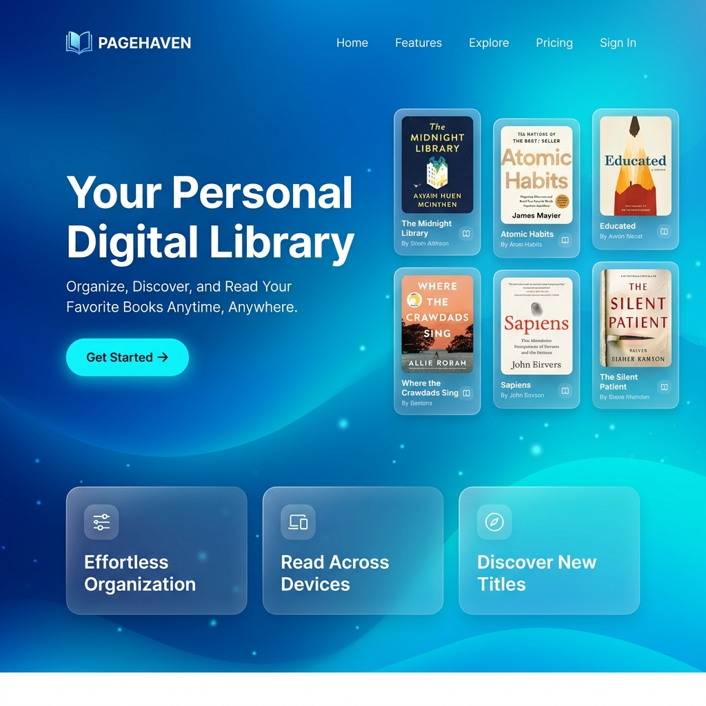
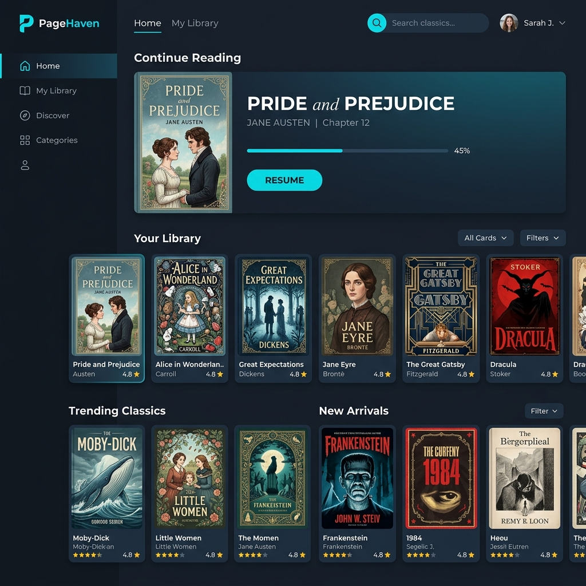
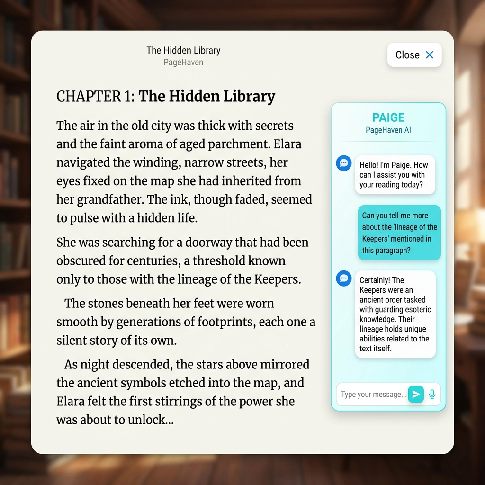

# 📖 PageHaven — Your AI-Powered Digital Library

<p align="center">
  
  
  
  
</p>

---

## ✨ Overview

**PageHaven** is a premium, full-stack digital library designed for the modern reader. It blends the timeless beauty of classic literature with cutting-edge **AI intelligence** and a sleek, **Blue + Cyan SaaS aesthetic**. 

Browse thousands of public-domain books, interact with our AI reading assistant, and pick up exactly where you left off with our smart reading history tracking.

---

## 🚀 Key Features

- 🤖 **AI Reading Assistant** — Interrogate your books. Get instant summaries, context, and explanations powered by Llama 3.1 via Groq.
- 🕒 **Reading History** — Never lose your place. The "Continue Reading" dashboard lets you resume your journey with a single click.
- 🎨 **Premium UI/UX** — A hand-crafted, modern interface featuring Glassmorphism, smooth animations, and a Blue-Cyan design system.
- 📚 **Massive Archive** — Direct integration with Project Gutenberg and Open Library for unlimited access to classics.
- 📱 **Mobile Optimized** — Fully responsive experience designed for both desktop and smartphones (Android & iOS).
- 🔐 **Secure Profiles** — Personalized user experience with secure JWT authentication and custom profile management.

---

## 📸 Screenshots

<p align="center">
  <b>The Landing Experience</b><br/>
  
</p>

<p align="center">
  <b>Personalized Dashboard</b><br/>
  
</p>

<p align="center">
  <b>Immersive Reader with AI</b><br/>
  
</p>

---

## 🛠 Tech Stack

- **Backend**: FastAPI (Python), MongoDB (Atlas), Pydantic
- **Frontend**: Vanilla HTML5, Modern CSS3 (Variables + Gradients), JavaScript (ES6+)
- **AI Engine**: Groq SDK (Llama 3.1 8B/70B)
- **Data**: Open Library API, Project Gutenberg

---

## ⚡ Quick Start

### 1. Prerequisites
- Python 3.10+
- MongoDB Atlas Account
- Groq API Key (for AI features)

### 2. Setup
```bash
git clone https://github.com/saniya1013/pagehaven-digital-library.git
cd pagehaven-digital-library
pip install -r requirements.txt
```

### 3. Environment
Create a `.env` file:
```env
MONGO_URI=your_mongodb_uri
GROQ_API_KEY=your_groq_key
SECRET_KEY=your_secure_secret
```

### 4. Launch
```bash
# Start the production server
python run.py
```

Visit `http://localhost:8000` to start reading!

---

## 🤝 Contributing

Contributions are what make the open-source community such an amazing place to learn, inspire, and create. Any contributions you make are **greatly appreciated**.

---

<p align="center">
  Built with ♥ by <b>Saniya</b><br/>
  © 2026 PageHaven. Open Access. Digital Preservation.
</p>
